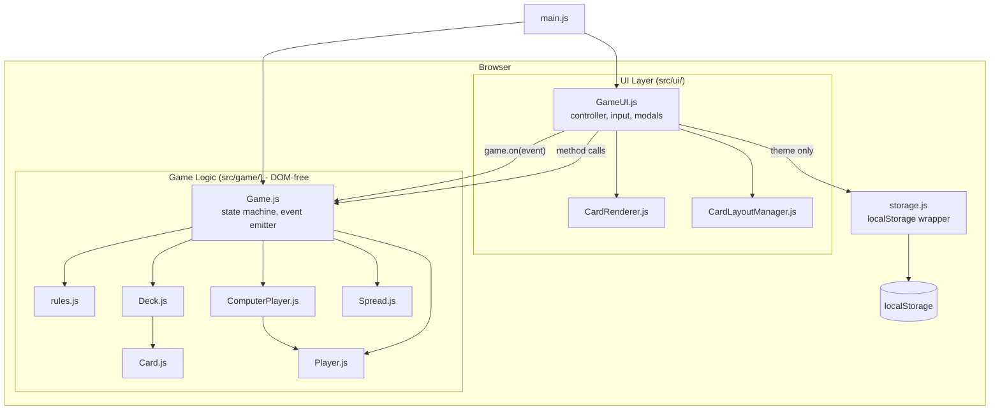
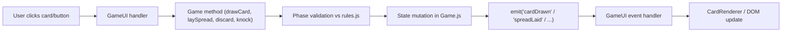

# Architecture, Third-Party Inventory, and Current Implementation

Single-page reference for: how the system is laid out, what third-party services it talks to, and how the existing codebase is organized. This is a fully client-side SPA; several standard sections (auth, backend data flow) are not applicable and are marked as such.

---

## 1. High-Level Architecture



**Key properties:**
- Strict layering: `src/game/` has zero DOM imports; UI reacts to a custom event emitter (ADR-002).
- No state-management library; game state lives in `Game.js`, UI state in `GameUI.js`.
- No network layer at all: zero runtime dependencies, no fetch/XHR anywhere.
- `Spread.js` and `rules.js` are bridge modules imported by both layers.

---

## 2. Auth Flow

Not applicable. There is no auth, no user identity, no session, and no network call. All state is local to the browser tab.

---

## 3. Canonical Data Flow (player turn)



**Notes:**
- Full event catalog (verified against `Game.js` emit calls): `gameInitialized`, `roundStart`, `cardsDealt`, `initialTonkDraw`, `turnStart`, `turnEnd`, `phaseChanged`, `cardDrawn`, `cardDiscarded`, `spreadLaid`, `spreadHit`, `knock`, `gameOver`, `antesCollected`, `betPlaced`, `potAwarded`.
- AI turns run the same path: GameUI sequences `ComputerPlayer` decisions with animation delays, and the AI calls back into Game methods.

---

## 4. Persistence Map

| localStorage key | Writer | Reader | Status |
|---|---|---|---|
| `tonk_deck_theme` | `GameUI` via `saveDeckTheme()` | `GameUI` via `loadDeckTheme()` | Wired and working |
| `tonk_statistics` | `storage.js updateStatistics()` | `storage.js loadStatistics()` | **Dead - no caller (BUG-001)** |
| `tonk_settings` | `storage.js saveSettings()` | `storage.js loadSettings()` | **Dead - no caller (F-004)** |

Active game state is intentionally not persisted (ADR-003); refresh = new game.

---

## 5. Third-Party Inventory

| Service | Where | Data exposed | Note |
|---|---|---|---|
| Google Fonts | `index.html` preconnect + stylesheet | Requester IP, user agent (standard font CDN exposure) | Only external touchpoint in the entire app |
| Vite/Rollup/esbuild toolchain | Dev/build only | n/a (nothing shipped) | See F-001 for advisories |

No analytics, no crash reporting, no backend, no CDN-hosted scripts.

---

## 6. Current Implementation Walkthrough

For the exhaustive file map see `CODE_MAP.md` at the repo root (refreshed 2026-06-10).

### 6.1 Bootstrap
- `index.html` → `src/main.js`: on DOMContentLoaded, constructs `Game` and `GameUI(game)`; exposes `window.game`/`window.ui` in dev builds only.

### 6.2 Game engine
- `Game.js` (702 lines): phase machine (`PRE_GAME → INITIAL_TONK_CHECK → START_OF_TURN → DRAW → ACTION → GAME_OVER`), turn flow, betting pot, win conditions, match scoring.
- `Spread.js`: book/run validation, hit rules, `findPossibleSpreads`.
- `rules.js`: constants only (phases, points, betting config).

### 6.3 AI
- `ComputerPlayer.js` (350 lines): heuristic decisions (`decideDraw`, `findBestSpread`, `shouldKnock`, `decideDiscard`, `decideBet`). Single difficulty profile.

### 6.4 UI
- `GameUI.js` (1,286 lines): all rendering, input, drag-drop reordering, modals (rules, settings, game over), betting controls, AI turn sequencing (see F-010).
- `CardRenderer.js`: card element factory. `CardLayoutManager.js`: ResizeObserver-based responsive sizing.
- `animations.js`: present but never imported (F-005); real animations are CSS-driven.

### 6.5 Shared / infrastructure
- `storage.js`: localStorage wrapper (partially dead, F-004). `helpers.js`: utilities, never imported (F-005).

---

## 7. Platform Verification Plan

What this pass verified and what a future pass should add:

### 7.1 Verified this pass (Windows, 2026-06-10)
```bash
npm install        # exit 0, 14 packages
npm run build      # exit 0, 352ms; dist: 10.07kB html / 50.95kB css / 45.51kB js
npm audit          # 4 vulnerabilities (3 high, 1 moderate)
```

### 7.2 Not verified (queue for next pass)
| Item | Needs |
|---|---|
| Full gameplay loop (deal → spreads → knock → scoring) | Manual playthrough or Playwright script against `npm run dev` |
| Multi-opponent games (2-3 AI) | Same harness |
| Mobile layout / drag-drop on touch | Device or emulator pass |
| Initial Tonk redeal edge case (multiple 49-50 hands) | Unit test once Vitest exists (F-002) |
| Stock-empty win condition | Unit test |

---
generated_by: codebase-audit skill v1.0
generated_on: 2026-06-10
project: C:\Users\Perry\Dropbox\PC\Documents\GitHub\tonk
project_type: node
verification: full
---
